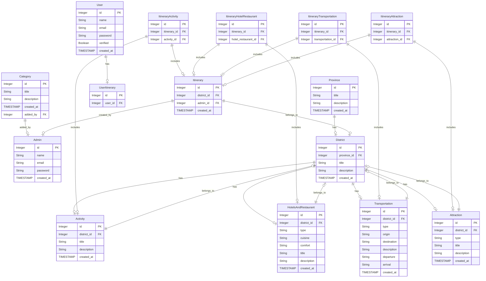

# travelsense-backend

&nbsp;

&nbsp;

&nbsp;

&nbsp;

&nbsp;

## Prerequisites  

- [python ≥ 3.10](https://www.python.org/downloads/)
- [postgresSQL ≥ 16.0](https://www.postgresql.org/download/)

---

## Database Table Structure

---

## Models Overview

### **Category**
- **Purpose**: Represents different categories of items or topics.
- **Relationships**: 
  - Linked to `Admin` (who added the category).

### **Province**
- **Purpose**: Represents geographical provinces.
- **Relationships**: 
  - Has many `Districts`.

### **District**
- **Purpose**: Represents smaller geographical areas within a province.
- **Relationships**: 
  - Linked to `Province` (each district belongs to one province).
  - Has many `Activities`, `HotelsAndRestaurants`, `Transportation`, and `Attractions`.

### **Activity**
- **Purpose**: Represents various activities that can be done in a district.
- **Relationships**: 
  - Linked to `District` (each activity is in one district).
  - Associated with itineraries through `ItineraryActivity`.

### **HotelsAndRestaurant**
- **Purpose**: Represents hotels and restaurants in a district.
- **Relationships**: 
  - Linked to `District` (each hotel/restaurant is in one district).
  - Associated with itineraries through `ItineraryHotelRestaurant`.

### **Transportation**
- **Purpose**: Represents transportation options within a district.
- **Relationships**: 
  - Linked to `District` (each transportation option is in one district).
  - Associated with itineraries through `ItineraryTransportation`.

### **Attraction**
- **Purpose**: Represents tourist attractions in a district.
- **Relationships**: 
  - Linked to `District` (each attraction is in one district).
  - Associated with itineraries through `ItineraryAttraction`.

### **User**
- **Purpose**: Represents the users of the application.
- **Relationships**: 
  - Can have `UserItineraries` (if you choose to implement user-specific itineraries).

### **UserItinerary**
- **Purpose**: (Currently not used) Links users to itineraries, allowing users to have personal itineraries.
- **Relationships**: 
  - Linked to `User` (each itinerary belongs to a user).

### **Itinerary**
- **Purpose**: Represents a planned itinerary which includes activities, hotels/restaurants, transportation, and attractions for a specific district.
- **Relationships**: 
  - Linked to `District` (each itinerary is for one district).
  - Linked to `Admin` (each itinerary is created by an admin).
  - Has many `Activities`, `HotelsAndRestaurants`, `Transportations`, and `Attractions` through their respective models.

### **ItineraryActivity**
- **Purpose**: Links activities to specific itineraries.
- **Relationships**: 
  - Linked to `Itinerary` (each record associates an activity with an itinerary).
  - Linked to `Activity` (each record specifies which activity is included in the itinerary).

### **ItineraryHotelRestaurant**
- **Purpose**: Links hotels and restaurants to specific itineraries.
- **Relationships**: 
  - Linked to `Itinerary` (each record associates a hotel/restaurant with an itinerary).
  - Linked to `HotelsAndRestaurant` (each record specifies which hotel/restaurant is included in the itinerary).

### **ItineraryTransportation**
- **Purpose**: Links transportation options to specific itineraries.
- **Relationships**: 
  - Linked to `Itinerary` (each record associates a transportation option with an itinerary).
  - Linked to `Transportation` (each record specifies which transportation option is included in the itinerary).

### **ItineraryAttraction**
- **Purpose**: Links attractions to specific itineraries.
- **Relationships**: 
  - Linked to `Itinerary` (each record associates an attraction with an itinerary).
  - Linked to `Attraction` (each record specifies which attraction is included in the itinerary).

### **Admin**
- **Purpose**: Represents the administrators of the system.
- **Relationships**: 
  - Can manage `Categories`, `SubCategories`, and `Itineraries`.

